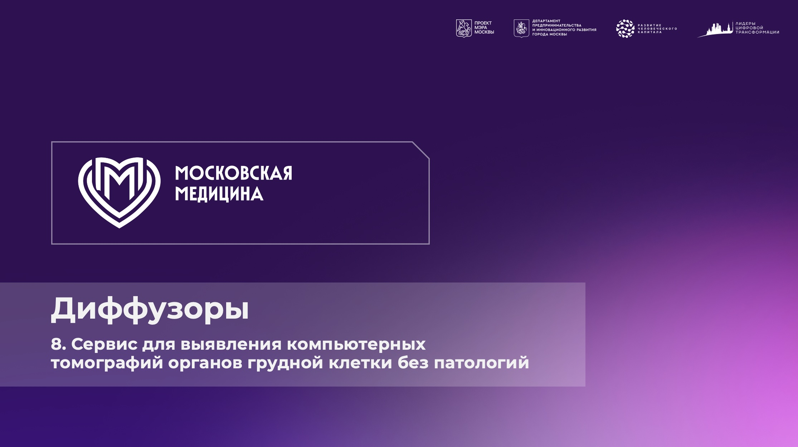
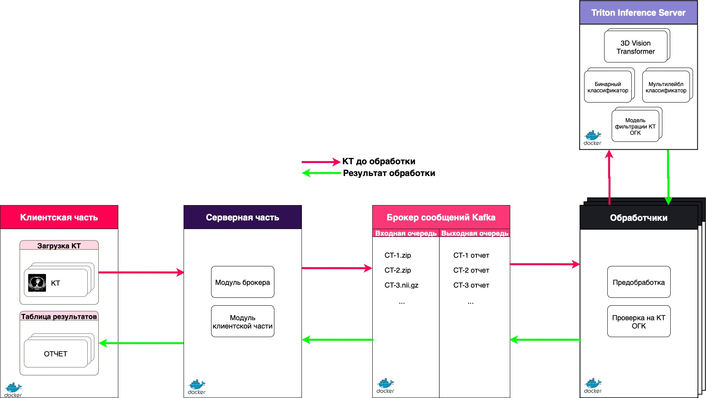
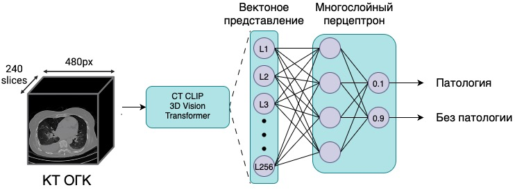
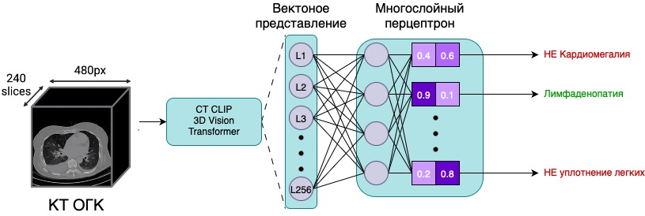
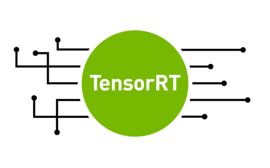

<p align="center">
  <strong>ЛИДЕРЫ ЦИФРОВОЙ ТРАНСФОРМАЦИИ 2025</strong>
</p>

---

<p align="center">
  СЕРВИС ДЛЯ ВЫЯВЛЕНИЯ КОМПЬЮТЕРНЫХ ТОМОГРАФИЙ ОРГАНОВ ГРУДНОЙ КЛЕТКИ БЕЗ ПАТОЛОГИЙ
</p>

---



# *Состав команды "Диффузоры"*
1. Козлов Михаил ([Telegram](https://t.me/borntowarn)) - MLE/MLOps
2. Карпов Даниил ([Telegram](https://t.me/Free4ky)) - MLE/MLOps

❗ По экстренным вопросам при неработоспособности сервиса или вопросам по развертыванию можно обращаться напрямую к нам в телеграм. ❗

# Оглавление
1. [Задание](#1)
2. [Решение](#2)
3. [Результат разработки](#3)
4. [Уникальность решения](#4)
5. [Стек](#5)
6. [Конфигурация оборудования](#6)
7. [Развертывание и тестирование](#7)
8. [Структура проекта](#8)
9. [Ссылки](#9)

# <a name="1">Задание</a>

Разработать программное обеспечение на основе
искусственного интеллекта для автоматической классификации КТ исследований ОГК на два класса: «без патологии» и «с патологией».

# <a name="2">Решение</a>

Нам удалось разработать сервис, который позволяет не только находить признаки нормы, но и определять какие именно патологии выявлены. 
Мы попробовали много подходов и моделей и решили остановиться на следующем пайплайне:

1. Считываем исследование.
2. Проверяем на КТ ОГК (по метаданным и с помощью модели Body Part Regression).
3. Если на вход пришло КТ ОГК, то получаем векторное представление через модель CT-CLIP 3D Vision Transformer, иначе отображаем оповещение об ошибке (в UI и файле предупреждений).
4. Получаем результат классификации на 2 класса и на 20 классов через соответствующие классификаторы.
5. Собираем финальный отчет, отображаем в UI и записываем в файл.

--- 

**Архитектура сервиса представлена на рисунке ниже:**

Решение представляет собой микросервисную архитектуру, состоящую из следущих компонентов:

1. *Клиент-серверная* часть выполнена с помощью фреймфорка Gradio.
2. *Модуль брокера сообщений* RabbitMQ/Kafka - для построения очередей и обмена сообщениями между компонентами
3. *Обработчики* – связующее звено между брокером и моделями в Triton Inference Server. Читают очереди, выполняют необходимую логику предобработки и проверки на КТ ОГК. Могут горизонтально масштабироваться (за счет копий), для увеличения пропускной способности.
4. *Triton Inference Server* — это открытое программное обеспечение, которое упрощает развертывание, запуск и масштабирование AI-моделей для быстрого выполнения на CPU или GPU. Модели в нем можно горизонтально масштабировать (за счет копий), для увеличения пропускной способности.

<p align="center">

</p>

---


**Архитектура модели бинарной классификации**

Архитектура состоит из двух основных частей:

1. *CT-CLIP 3D Vision Transformer* - выступает в роли модели векторизации КТ.
2. *Многослойный перцептрон* - обучен на **2 класса** (без патологии, с патологией). Для решения проблемы дисбаланса классов использовались функция потерь **FocalLoss** и балансировка семплов через **WeightedRandomSampler**. Кол-во слоев подобрано optuna оптимизацией.

<p align="center">

</p>

---

**Архитектура модели мультилейбл классификации**

Архитектура состоит из двух основных частей:

1. *CT-CLIP 3D Vision Transformer* - выступает в роли модели векторизации КТ.
2. *Многослойный перцептрон* - обучен на 20 классов в парадигме мультилейбл классификации (на одном КТ могут быть сразу несколько патологий). Функция потерь Weighted BCE. Кол-во слоев подобрано optuna оптимизацией.

<p align="center">

</p>

---

# <a name="3">Результат разработки</a>
В ходе решения поставленной задачи нам удалось реализовать *рабочий* прототип со следующими компонентами:

1. Сконвертированные в TensorRT и ONNX модели: CT-CLIP 3D Vision Transformer, Бинарный классификатор, Мультилейбл классификатор. Выстроен ансамбль взаимодействия моделей в Triton.

2. Отдельная модель фильтрации КТ ОГК, которая тоже развернута в Triton.

3. Очереди RabbitMQ/Kafka для бесперебойной обработки.

4. Triton Inference Server, на котором развернуты модели.

5. Обработчики - связующее звено между моделью и очередями.

6. Наше решение отлично справляется с задачей определения нормы, показывая значения **AUROC 0.790 и 0.721** на датасетах CT-RATE и MosMedData соответственно. (Среднее значение из 95% доверительного интеравала методом bootstrap).

# <a name="4">Уникальность решения</a>

1. Обработанный объем КТ для обучени модели - более 8 ТБ.

2. Архитектура промышленного уровня, готовая к внедрению и масштабированию.

3. Высокая скорость работы – среднее время обработки исследования 10 секунд.

4. Поддержка бинарной и мультилейбл классификации.

5. Автоопределение КТ ОГК.

6. Подробная информация об ошибках включается в итоговый отчёт.

7. Реализован подсчет процента пропущенных слайсов в исследовании.

8. Автоматизирован подбор гиперпараметров.

9. Возможно обучение модели с текстовой модальностью.

10. Возможен выбор брокера сообщений - Kafka или RabbitMQ. :warning: *Для упрощения развертывания решения был выбран RabbitMQ, т.к. он менее требовательный и более прост в эксплуатации*


# <a name="5">Стек</a>

<div>
  
  &nbsp;
  &nbsp;
  &nbsp;
  &nbsp;
  &nbsp;
  &nbsp;
  &nbsp;
  &nbsp;

# <a name="6">Конфигурация оборудования</a>

Тестирование системы проводилось на следующих конфигурациях оборудования для того чтобы обеспечить максимальную совместимость:
1. *Ubuntu 22.04*
- Intel core i5-12400
- 64 GB RAM
- GPU NVIDIA RTX 3090ti 24GB VRAM
2. *Windows 11*
- Intel core i5-13400
- 64 GB RAM
- GPU NVIDIA RTX 3090ti 24GB VRAM
3. *WSL2 (Windows 11)*
- Intel core i5-13400
- 64 GB RAM
- GPU NVIDIA RTX 3090ti 24GB VRAM
4. *Windows 10*
- Intel core i5-10400
- 16 GB RAM
- GPU NVIDIA RTX 4060 16GB VRAM

⚠️ Минимально необходимый размер VRAM:

- Только для инференса моделей - 8GB
- Для развертывания сервиса - 12GB


# <a name="7">Развертывание и тестирование. Подробная документация [здесь](./docs/README.md)</a>

#### Предварительные требования
- Желательно Linux, однако проверено на Windows и Windows+WSL2.
- `Docker 24+`, `Docker Compose v2`.
- NVIDIA драйвер и `NVIDIA Container Toolkit`.

ℹ️ Перед запуском проверьте доступность GPU и корректность версий драйверов/CUDA.

Проверка GPU:
```bash
nvidia-smi
```

## Быстрый старт для внутреннего тестирования. Подробная документация [здесь](./docs/inference.md#1-быстрый-старт-из-заранее-подготовленных-образов-предпочтительный-вариант)

1. Внутри файла `inference.remote.sh` необходимо заменить переменную `YOUR_INPUT_FOLDER_WITH_ZIPS` на абсолютный путь к папке с архивами.

⚠️ Используйте АБСОЛЮТНЫЙ путь к входной папке, иначе контейнер не увидит данные.

Таким образом ваш скрипт для развертывания решения будет выглядеть следующим образом:
```bash
#!/bin/bash

# Путь к входным данным в папке (рекомендуется указать АБСОЛЮТНЫЙ путь)
# Папка с zip-файлами должна иметь структуру вида:
# YOUR_INPUT_FOLDER_WITH_ZIPS/
#   study_id_1.zip
#   study_id_2.zip
#   ...
#   final_archive.zip

# НАПРИМЕР: YOUR_INPUT_FOLDER_WITH_ZIPS="/home/borntowarn/projects/chest-diseases/input"

# НАПРИМЕР: YOUR_INPUT_FOLDER_WITH_ZIPS="C:/ВАШ/ПУТЬ/К/ПАПКЕ/С/АРХИВАМИ"

# НАПРИМЕР: YOUR_INPUT_FOLDER_WITH_ZIPS="C:\ВАШ\ПУТЬ\К\ПАПКЕ\С\АРХИВАМИ"

###########################################################################
#                                                                         #
#   Будьте внимательны, необходимо передать путь к ПАПКЕ, а не к файлу!   #
#                                                                         #
###########################################################################

YOUR_INPUT_FOLDER_WITH_ZIPS="/home/borntowarn/projects/chest-diseases/input"
YOUR_OUTPUT_FOLDER="/$PWD/output"

docker run \
    -it \
    --gpus "all" \
    -e INPUT_FOLDER="./input" \
    -v "$YOUR_INPUT_FOLDER_WITH_ZIPS":/training/input \
    -v "$YOUR_OUTPUT_FOLDER":/training/output \
    borntowarn/porcupine-inference
```

-  Папка `INPUT_FOLDER="./input"` - внутренняя папка, в которую будут монтироваться входные данные из папки `YOUR_INPUT_FOLDER_WITH_ZIPS`
-  Папка `YOUR_OUTPUT_FOLDER` - папка, в которую будут сохраняться результаты инференса: файлы `output.xlsx` и `warnings_and_errors.txt`. Она автоматически примонтируется в локальной файловой системе и будет доступна.

2. Запустить скрипт:
```bash
bash ./inference.remote.sh
```

## Быстрый старт для развертывания сервиса. Подробная документация [здесь](./docs/start_services.md)
1. Запустите стек:
```bash
bash ./start.remote.sh
```
2. Откройте интерфейс: `http://localhost:7860` (ℹ️ не забудьте прокинуть порт на хост машину, если вы работаете через SSH)
3. Остановите стек:
```bash
bash ./stop.remote.sh
```

Открытые порты:
- Triton: `8000` (HTTP), `8001` (gRPC), `8002` (Metrics)
- RabbitMQ: `5672` (AMQP), `15672` (Management UI, логин/пароль: `guest/guest`)
- Frontend (Gradio): `7860`

ℹ️ Если порты заняты, остановите конфликтующие сервисы или измените порт-маппинг в compose.


# <a name="8">Структура проекта</a>

```
.                                   # Корневая директория проекта
├── configs                         # Папка с конфигурационными файлами
│   └── config.yaml                 # Главный YAML-файл с настройками для сервисов
├── convertation                    # Модули и скрипты для конвертации моделей
│   ├── head                        # Конвертация моделей "head" (головы нейросети)
│   │   ├── convert2trt.sh          # Bash-скрипт для преобразования модели в формат TensorRT
│   │   └── torch2onnx.py           # Python-скрипт для конвертации PyTorch-модели в ONNX
│   ├── vit                         # Конвертация моделей Vision Transformer (ViT)
│   │   ├── transformer_maskgit     # Папка с файлами и кодом для модели MaskGIT
│   │   ├── convert2trt.sh          # Bash-скрипт для конвертации ViT в TensorRT
│   │   ├── test_onnx.py            # Тестирование работоспособности ONNX-модели ViT
│   │   └── torch2onnx.py           # Конвертация ViT из PyTorch в ONNX
│   ├── Dockerfile                  # Dockerfile для контейнеризации процесса конвертации
│   ├── README.md                   # Документация по использованию конвертации
│   ├── compose.yaml                # Docker Compose файл для запуска конвертации в контейнере
│   └── run.sh                      # Скрипт для запуска контейнера конвертации
├── docs                            # Папка с документацией
│   ├── README.md                   # Основной файл с документацией по проекту
│   ├── development.md              # Документация по разработке
│   ├── inference.md                # Документация по инференсу для внутреннего тестирования
│   ├── models.md                   # Документация по моделям
│   └── start_services.md           # Документация по запуску сервисов для развертывания
├── model_repository_running        # Папка с готовыми моделями для Triton Inference Server (тут должны быть распакованные модели для локальной сборки)
├── services                        # Каталог с микросервисами проекта
│   ├── adapter                     # Сервис-адаптер для взаимодействия между компонентами
│   │   ├── src                     # Исходный код адаптера
│   │   ├── Dockerfile              # Dockerfile для сборки контейнера адаптера
│   │   ├── __init__.py             # Инициализация Python-пакета адаптера
│   │   ├── __main__.py             # Главная точка входа адаптера (запуск сервиса)
│   │   └── requirements.txt        # Список Python-зависимостей адаптера
│   └── frontend                    # Сервис пользовательского интерфейса (фронтенд)
│       ├── src                     # Исходный код фронтенда
│       ├── Dockerfile              # Dockerfile для сборки контейнера фронтенда
│       ├── __init__.py             # Инициализация Python-пакета фронтенда
│       ├── __main__.py             # Главная точка входа фронтенда (запуск сервиса)
│       └── requirements.txt        # Список Python-зависимостей фронтенда
├── storage                         # Общий том/данные для сервисов (монтируется в контейнеры)
├── training                        # Папка для обучения, инференса и всевозможных тестов моделей и данных. README внутри
├── visualisation                   # Визуализация эмбеддингов в UI
│   ├── Dockerfile                  # Образ для окружения визуализации
│   └── viz_embeddings_fiftyone.py  # Скрипт визуализации эмбеддингов (FiftyOne)
├── Dockerfile.inference.yaml       # Образ одиночного инференса (docker run)
├── Dockerfile.triton.yaml          # Образ Triton с установкой зависимостей модели BPR
├── README.md                       # Основной файл с документацией по проекту
├── compose.local.yaml              # Docker Compose для локального билда и запуска всех сервисов (локальная сборка образов)
├── compose.remote.yaml             # Docker Compose для запуска всех сервисов из готовых образов Docker Hub
├── inference.local.sh              # Локальная сборка и запуск инференса
├── inference.remote.sh             # Запуск инференса из Docker Hub (подготовленный образ, предпочтительнее)
├── requirements.txt                # Питон-зависимости проекта для локальных запусков
├── start.local.sh                  # Локальная сборка образов и запуск сервисов группы base (tritonserver, rabbitmq, adapter, frontend)
├── start.remote.sh                 # Загрузка подготовленных образов и запуск сервисов группы base (tritonserver, rabbitmq, adapter, frontend)
├── stop.local.sh                   # Остановка сервисов группы base запущенных локально (tritonserver, rabbitmq, adapter, frontend)
└── stop.remote.sh                  # Остановка сервисов группы base запущенных из Docker Hub (tritonserver, rabbitmq, adapter, frontend)
```

# <a name="9">Ссылки</a>
- Яндекс диск со всеми материалами, весами, презентацией и демо [ссылка](https://disk.yandex.ru/d/nq0x0-Ivx93VJw)
- Ссылка на развернутый сервис: [ссылка](http://87.236.30.202:7860)
- Подробная документация: [ссылка](./docs/README.md)
- Для связи 1: https://t.me/borntowarn
- Для связи 2: https://t.me/Free4ky